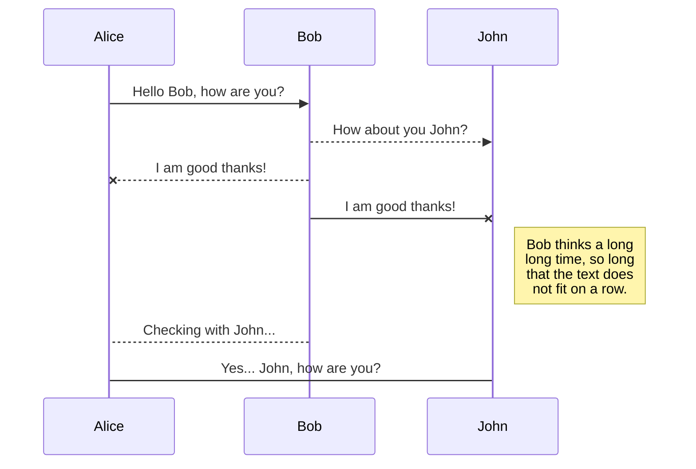
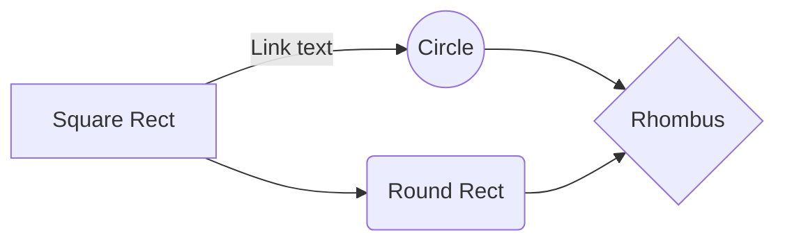

# AzA : 학생관리플랫폼

수업관리와 소통을 하나의 앱에서, **아자 학생관리시스템**
**아자**는 언택트 시대에 선생님, 학생, 학부모가 보다 효율적으로 학업을 관리할 수 있는 교육용 플랫폼으로, 학생 출결 관리, 일정 관리, 비대면 결제 및 메신저 서비스를 제공합니다.

## Contents

-   [프로젝트 개요](https://github.com/gitpoint/git-point#introduction)
-   [Features](https://github.com/gitpoint/git-point#features)
-   [Feedback](https://github.com/gitpoint/git-point#feedback)
-   [Contributors](https://github.com/gitpoint/git-point#contributors)
-   [Build Process](https://github.com/gitpoint/git-point#build-process)
-   [Backers](https://github.com/gitpoint/git-point#backers-)
-   [Sponsors](https://github.com/gitpoint/git-point#sponsors-)
-   [Acknowledgments](https://github.com/gitpoint/git-point#acknowledgments)
## 프로젝트 개요

* 개발 기간 : 2022.04.28~2022.06.30
	* 분석 설계 : 4주
	* 구현 : 4주
	* 자료 정리 : 1주
* 개발 팀원 : **조혜미(조장)** / 안경호 / 조미연 / 이용승 / 노민정
* 팀 내 맡은 역할 :   
		- 성적 : 
			학생 성적 등록 / 조회 / 수정 / 삭제
		- 채팅 :
			채팅 등록 / 조회 / 수정 / 삭제 
		- 알림 :
			알림 등록 / 조회 / 수정 / 삭제
		- 출결 :
			출석 등록 / 조회 / 수정 / 삭제
		- 전체 학생 목록 :
			수업 추가 / 조회 / 수정 / 삭제
			학생 승인 / 삭제
		- Common :
			기타 공통, error page 등
* 기술적 고려사항
	* 프로그래밍 언어 :
		Java, Servlet, JSP
	* 적용 Architecture :
		2Layer, MVC, Interface base, Controller, RestController
	* 적용 Framework : 
		Spring Boot, Mybatis, Bootstrap
	* 웹 표준 기술 :
		CSS3, HTML5, Javascript, JQuery, Ajax, Node.js, Lombok, Sock.js
	* DB관리 기술:
		Oracle DB, Mongo DB
	* 기술적 특이사항 <적용 Open API> :
		FullCalendar API, Naver Search API, NAVER CLOVA chatbot API, NAVER sens API, I'mport API, Chart.js, SweetAlert, DataTable.js, Matrial.js, Scripts.js
	
* 구현 영상 : https://drive.google.com/file/d/1gptKkNvCIh_jwRwpRKe7ffj2_0yuMhbI/view?usp=sharing
* 요약 PPT : 
https://drive.google.com/file/d/1Nqb813pXgP_7iNaknPhfCRpmO69CbUge/view?usp=sharing
* 프로젝트 보고서 :
https://drive.google.com/file/d/11Vca6Uh9ZjoLYHcvNb2NnpGv-_VJjWCl/view?usp=sharing

## Useage

The file explorer is accessible using the button in left corner of the navigation bar. You can create a new file by clicking the **New file** button in the file explorer. You can also create folders by clicking the **New folder** button.

## CODE
* 학생관리 - 출석
* 학생관리 - 성적
* 학생관리 - 학생목록
* 알림
* 채팅
* 공통
All your files and folders are presented as a tree in the file explorer. You can switch from one to another by clicking a file in the tree.

### 학생관리 - 출석

1. 학생 출석 등록
	*  com.aza.service.students.impl.StudentsServiceImpl.addStudentsAttendance()
		* 현재 시간을 sysdate로 받아, 당일 진행하는 수업 목록을 HOME에서 출력
		* 출석 등록을 원하는 수업을 클릭하면, 해당 수업을 듣는 학생 목록 출력
		* 해당 학생의 출석 상태를 등록, 수정할 수 있음
		* 출석 등록 시, 해당 학생의 부모님에게 알림 전송
		* 조퇴, 도망으로 수정 시, 해당 학생의 부모님에게 알림 전송
You can rename the current file by clicking the file name in the navigation bar or by clicking the **Rename** button in the file explorer.

## Delete a file

You can delete the current file by clicking the **Remove** button in the file explorer. The file will be moved into the **Trash** folder and automatically deleted after 7 days of inactivity.

## Export a file

You can export the current file by clicking **Export to disk** in the menu. You can choose to export the file as plain Markdown, as HTML using a Handlebars template or as a PDF.

# Synchronization

Synchronization is one of the biggest features of StackEdit. It enables you to synchronize any file in your workspace with other files stored in your **Google Drive**, your **Dropbox** and your **GitHub** accounts. This allows you to keep writing on other devices, collaborate with people you share the file with, integrate easily into your workflow... The synchronization mechanism takes place every minute in the background, downloading, merging, and uploading file modifications.

There are two types of synchronization and they can complement each other:

- The workspace synchronization will sync all your files, folders and settings automatically. This will allow you to fetch your workspace on any other device.
	> To start syncing your workspace, just sign in with Google in the menu.

- The file synchronization will keep one file of the workspace synced with one or multiple files in **Google Drive**, **Dropbox** or **GitHub**.
	> Before starting to sync files, you must link an account in the **Synchronize** sub-menu.

## Open a file

You can open a file from **Google Drive**, **Dropbox** or **GitHub** by opening the **Synchronize** sub-menu and clicking **Open from**. Once opened in the workspace, any modification in the file will be automatically synced.

## Save a file

You can save any file of the workspace to **Google Drive**, **Dropbox** or **GitHub** by opening the **Synchronize** sub-menu and clicking **Save on**. Even if a file in the workspace is already synced, you can save it to another location. StackEdit can sync one file with multiple locations and accounts.

## Synchronize a file

Once your file is linked to a synchronized location, StackEdit will periodically synchronize it by downloading/uploading any modification. A merge will be performed if necessary and conflicts will be resolved.

If you just have modified your file and you want to force syncing, click the **Synchronize now** button in the navigation bar.

> **Note:** The **Synchronize now** button is disabled if you have no file to synchronize.

## Manage file synchronization

Since one file can be synced with multiple locations, you can list and manage synchronized locations by clicking **File synchronization** in the **Synchronize** sub-menu. This allows you to list and remove synchronized locations that are linked to your file.

# Publication

Publishing in StackEdit makes it simple for you to publish online your files. Once you're happy with a file, you can publish it to different hosting platforms like **Blogger**, **Dropbox**, **Gist**, **GitHub**, **Google Drive**, **WordPress** and **Zendesk**. With [Handlebars templates](http://handlebarsjs.com/), you have full control over what you export.

> Before starting to publish, you must link an account in the **Publish** sub-menu.

## Publish a File

You can publish your file by opening the **Publish** sub-menu and by clicking **Publish to**. For some locations, you can choose between the following formats:

- Markdown: publish the Markdown text on a website that can interpret it (**GitHub** for instance),
- HTML: publish the file converted to HTML via a Handlebars template (on a blog for example).

## Update a publication

After publishing, StackEdit keeps your file linked to that publication which makes it easy for you to re-publish it. Once you have modified your file and you want to update your publication, click on the **Publish now** button in the navigation bar.

> **Note:** The **Publish now** button is disabled if your file has not been published yet.

## Manage file publication

Since one file can be published to multiple locations, you can list and manage publish locations by clicking **File publication** in the **Publish** sub-menu. This allows you to list and remove publication locations that are linked to your file.

# Markdown extensions

StackEdit extends the standard Markdown syntax by adding extra **Markdown extensions**, providing you with some nice features.

> **ProTip:** You can disable any **Markdown extension** in the **File properties** dialog.

## SmartyPants

SmartyPants converts ASCII punctuation characters into "smart" typographic punctuation HTML entities. For example:

|                |ASCII                          |HTML                         |
|----------------|-------------------------------|-----------------------------|
|Single backticks|`'Isn't this fun?'`            |'Isn't this fun?'            |
|Quotes          |`"Isn't this fun?"`            |"Isn't this fun?"            |
|Dashes          |`-- is en-dash, --- is em-dash`|-- is en-dash, --- is em-dash|

## KaTeX

You can render LaTeX mathematical expressions using [KaTeX](https://khan.github.io/KaTeX/):

The *Gamma function* satisfying $\Gamma(n) = (n-1)!\quad\forall n\in\mathbb N$ is via the Euler integral

$$
\Gamma(z) = \int_0^\infty t^{z-1}e^{-t}dt\,.
$$

> You can find more information about **LaTeX** mathematical expressions [here](http://meta.math.stackexchange.com/questions/5020/mathjax-basic-tutorial-and-quick-reference).

## UML diagrams

You can render UML diagrams using [Mermaid](https://mermaidjs.github.io/). For example, this will produce a sequence diagram:

And this will produce a flow chart:

